# 🎬 CineBook — Aplikasi Booking Tiket Bioskop


## 1. Deskripsi Aplikasi

CineBook adalah aplikasi mobile booking tiket bioskop yang dibuat menggunakan Flutter. Aplikasi ini merupakan pengembangan dari Mini Project 1 dengan penambahan integrasi database menggunakan Supabase, sistem autentikasi pengguna, serta fitur tampilan Light Mode dan Dark Mode.

Data booking tidak lagi disimpan secara lokal, tetapi langsung tersimpan di database Supabase sehingga dapat diakses secara real-time. Pengguna harus login terlebih dahulu sebelum menggunakan aplikasi, dan setiap pengguna hanya dapat melihat serta mengelola data booking miliknya sendiri melalui penerapan Row Level Security (RLS). Proses pemesanan tiket dilakukan dengan memilih film, jadwal tayang, dan kursi yang tersedia, dengan harga tiket yang muncul otomatis sesuai tipe studio yang dipilih.


## 2. Fitur Aplikasi

### Fitur CRUD

| Fitur | Keterangan |
|-------|-----------|
| **Create** | Menambahkan data booking baru dan menyimpannya ke Supabase |
| **Read** | Menampilkan daftar booking milik user yang sedang login dari Supabase |
| **Update** | Mengedit data booking yang sudah tersimpan di Supabase |
| **Delete** | Menghapus data booking dari Supabase dengan konfirmasi dialog |

### Fitur Tambahan

| Fitur | Keterangan |
|-------|-----------|
| **Login & Register** | Autentikasi pengguna menggunakan Supabase Auth (nilai tambah) |
| **Light & Dark Mode** | Tema terang dan gelap yang bisa diubah kapan saja (nilai tambah) |
| **File .env** | Supabase URL dan API Key disimpan di file `.env`, tidak hardcode (nilai tambah) |
| **Multi-Page Navigation** | Navigasi antar 6 halaman menggunakan `Navigator.push` dan `Navigator.pop` |
| **Pilih Film & Jadwal** | Film dan jadwal dipilih dari daftar yang disediakan sistem |
| **Pilih Kursi** | Kursi otomatis menyesuaikan studio dari jadwal yang dipilih |
| **Harga Otomatis** | Harga tiket muncul otomatis berdasarkan tipe studio |
| **Form Validation** | Validasi field wajib, nomor HP hanya angka, email wajib `@gmail.com` |
| **Row Level Security** | Setiap user hanya bisa melihat dan mengelola booking miliknya sendiri |
| **Loading Indicator** | Tampilan loading saat proses simpan, edit, hapus, dan ambil data |
| **Snackbar Notifikasi** | Feedback visual saat operasi berhasil atau gagal |
| **Alert Dialog Konfirmasi** | Konfirmasi sebelum menghapus data booking |
| **Refresh Data** | Tombol refresh dan pull-to-refresh untuk memuat ulang data dari Supabase |


## 3. Widget yang Digunakan

| Widget | Keterangan |
|--------|-----------|
| `Scaffold` | Struktur dasar setiap halaman |
| `AppBar` | Bar judul di bagian atas halaman |
| `Column` & `Row` | Menyusun widget secara vertikal dan horizontal |
| `Container` | Membungkus widget dengan dekorasi (warna, border, shadow) |
| `SafeArea` | Menghindari tumpang tindih dengan notch atau status bar |
| `SingleChildScrollView` | Membuat halaman form bisa di-scroll |
| `ListView.builder` | Menampilkan daftar booking secara efisien |
| `Form` | Mengelola state dan validasi form secara keseluruhan |
| `TextFormField` | Input teks dengan validasi (nama, nomor HP, email, password) |
| `TextEditingController` | Mengontrol dan membaca nilai input teks |
| `DropdownButtonFormField` | Pilihan film, jadwal tayang, dan kursi |
| `ElevatedButton` | Tombol aksi utama (login, daftar, konfirmasi, simpan) |
| `IconButton` | Tombol ikon (back, logout, toggle tema, refresh, show/hide password) |
| `GestureDetector` | Mendeteksi aksi tap pada widget kartu dan teks link |
| `AlertDialog` | Dialog konfirmasi sebelum menghapus booking |
| `SnackBar` | Notifikasi pesan singkat di bagian bawah layar |
| `CircularProgressIndicator` | Indikator loading saat proses berlangsung |
| `RefreshIndicator` | Pull-to-refresh pada halaman daftar booking |
| `BoxDecoration` | Dekorasi container dengan warna, border, dan shadow |
| `Icon` | Ikon dari library `Icons` bawaan Flutter |
| `Navigator` | Mengatur navigasi antar halaman |
| `Consumer` | Mendengarkan perubahan ThemeProvider dari package Provider |
| `ChangeNotifierProvider` | Menyediakan state ThemeProvider ke seluruh widget tree |


## 4. Halaman Aplikasi

| Halaman | Fungsi |
|---------|--------|
| `login_page.dart` | Halaman login dengan email dan password |
| `register_page.dart` | Halaman pendaftaran akun baru |
| `home_page.dart` | Halaman utama dengan menu navigasi dan tombol logout |
| `add_booking_page.dart` | Form pembuatan booking baru, data disimpan ke Supabase |
| `my_booking_page.dart` | Daftar booking dari Supabase, fitur Read, Delete, dan navigasi Edit |
| `edit_booking_page.dart` | Form edit booking, perubahan di-update ke Supabase |


## 5. Struktur Database Supabase

### Tabel `bookings`

| Kolom | Tipe | Keterangan |
|-------|------|-----------|
| `id` | uuid | Primary key, auto-generate |
| `nama_film` | text | Judul film yang dipesan |
| `jadwal` | text | Jadwal tayang yang dipilih |
| `studio` | text | Studio tempat pemutaran |
| `kursi` | text | Nomor kursi yang dipilih |
| `harga` | integer | Harga tiket (otomatis dari studio) |
| `nama_pemesan` | text | Nama lengkap pemesan |
| `no_hp` | text | Nomor HP pemesan |
| `email` | text | Email pemesan |
| `user_id` | uuid | Foreign key ke `auth.users` |
| `created_at` | timestamp | Waktu booking dibuat |


## 6. Sistem Harga Tiket

| Studio | Harga |
|--------|-------|
| Studio 1 & Studio 2 | Rp 45.000 |
| Studio VIP | Rp 75.000 |
| Studio IMAX | Rp 95.000 |


## 7. Struktur Folder


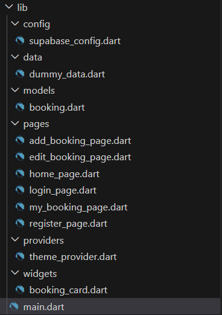


### Setup Supabase
Jalankan SQL berikut di Supabase SQL Editor untuk membuat tabel dan mengaktifkan RLS:

```sql
create table bookings (
  id uuid default gen_random_uuid() primary key,
  nama_film text not null,
  jadwal text not null,
  studio text not null,
  kursi text not null,
  harga integer not null,
  nama_pemesan text not null,
  no_hp text not null,
  email text not null,
  user_id uuid references auth.users(id) on delete cascade,
  created_at timestamp with time zone default now()
);

alter table bookings enable row level security;

create policy "Users can view own bookings" on bookings for select using (auth.uid() = user_id);
create policy "Users can insert own bookings" on bookings for insert with check (auth.uid() = user_id);
create policy "Users can update own bookings" on bookings for update using (auth.uid() = user_id);
create policy "Users can delete own bookings" on bookings for delete using (auth.uid() = user_id);
```

------
# Tampilan Aplikasi 📱

### Login & Register

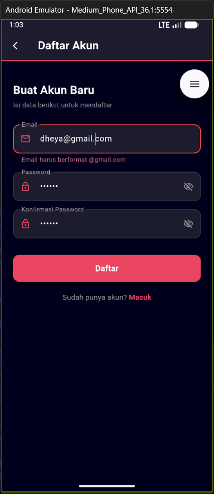

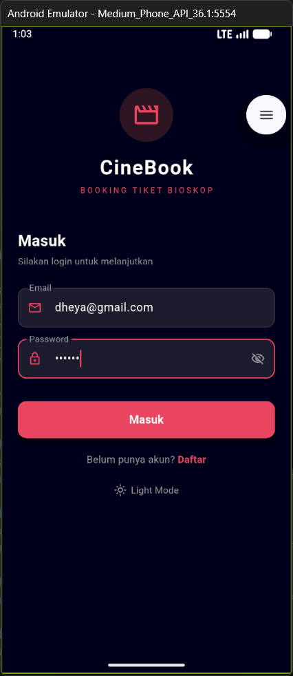

### Home
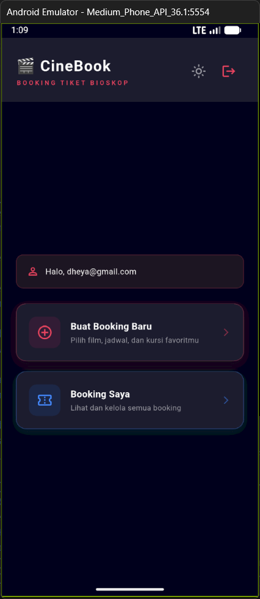
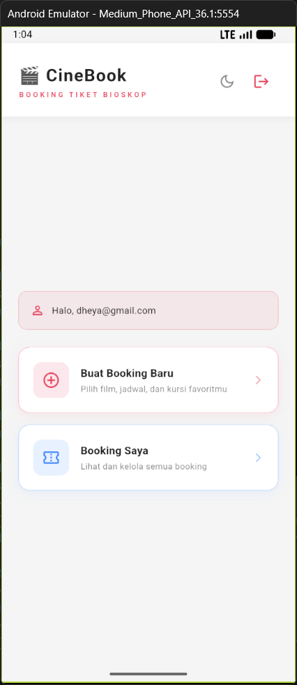

### Booking
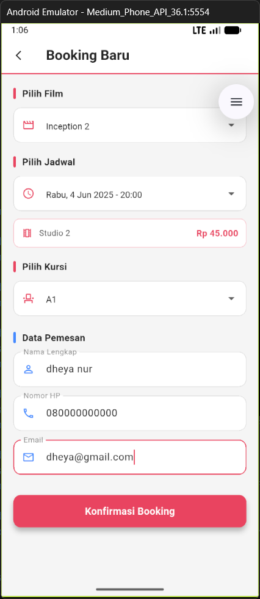

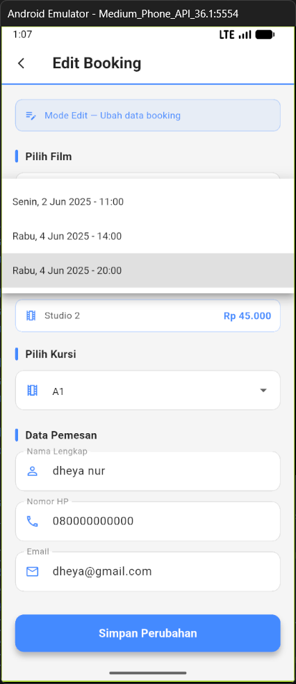

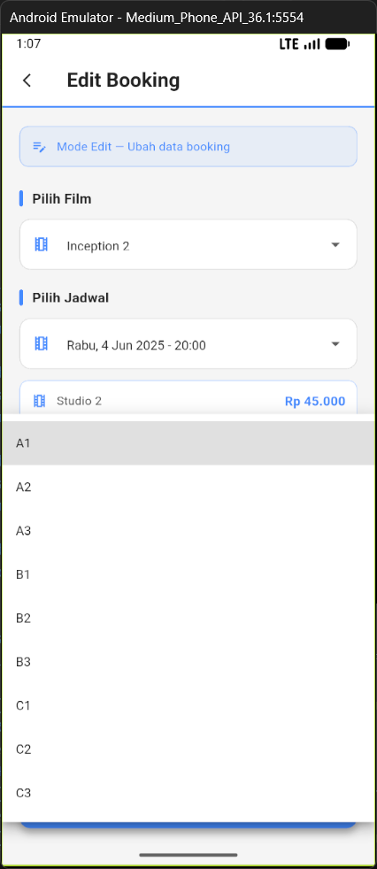

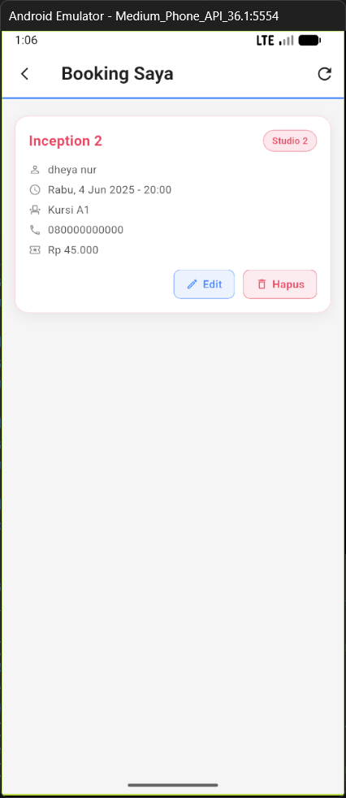

### Edit
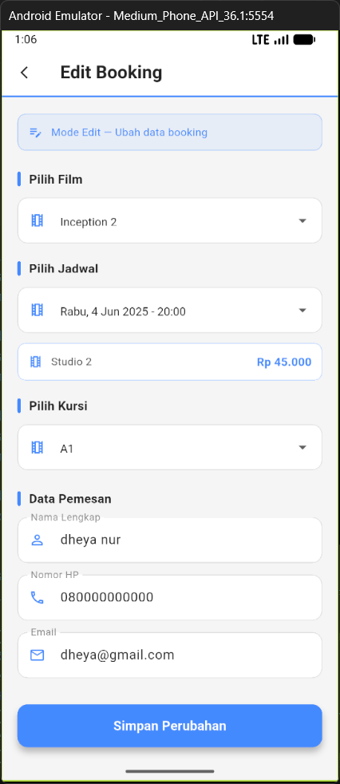

### Hapus
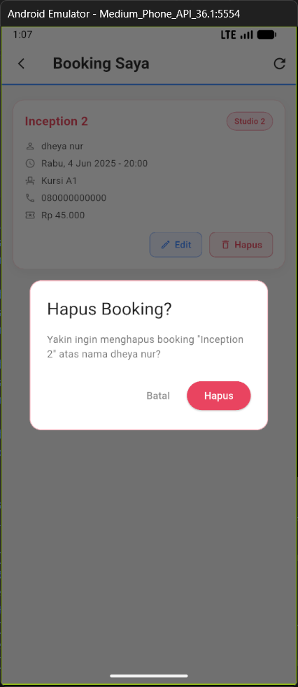

